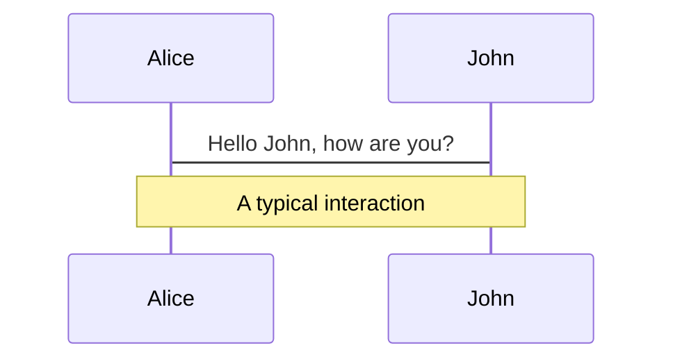
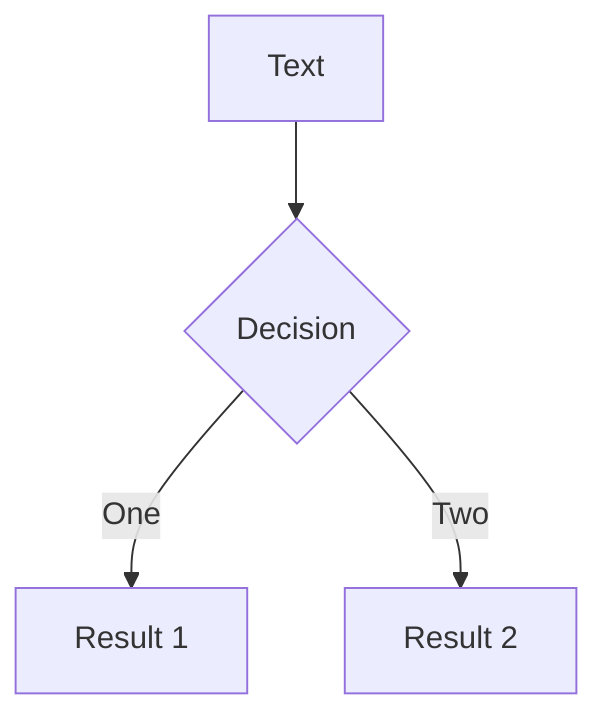
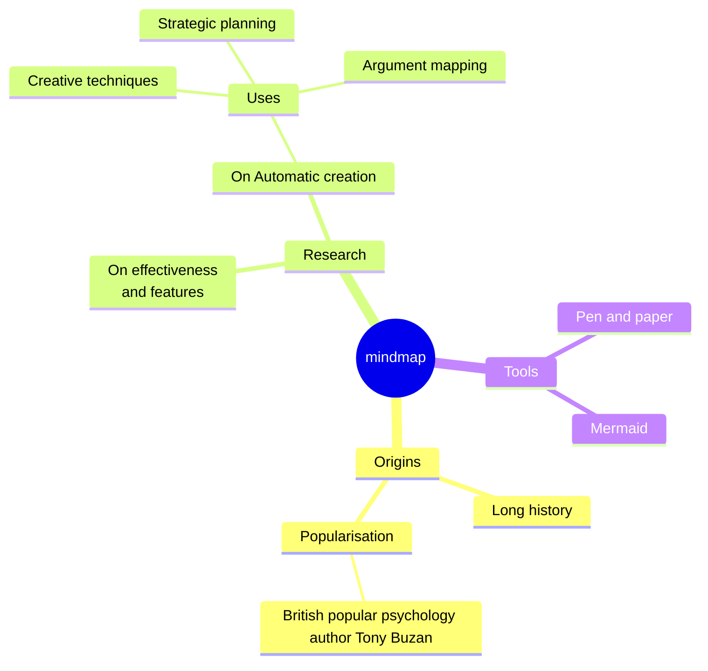
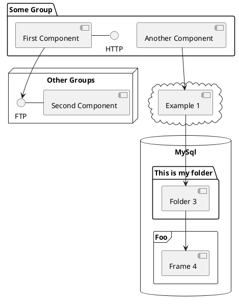

---
# You can also start simply with 'default'
theme: seriph
# random image from a curated Unsplash collection by Anthony
# like them? see https://unsplash.com/collections/94734566/slidev
background: https://cover.sli.dev
# some information about your slides (markdown enabled)
title: 2024 CSS Trend
info: |
  ## 2024 CSS Trend
  Fuck off JS
# apply unocss classes to the current slide
class: text-center
# https://sli.dev/features/drawing
drawings:
  persist: false
# slide transition: https://sli.dev/guide/animations.html#slide-transitions
transition: slide-left
# enable MDC Syntax: https://sli.dev/features/mdc
mdc: true
# take snapshot for each slide in the overview
overviewSnapshots: true
---

# 2024 CSS Trend

### Fuck off JS

<style>
  h3{
    opacity: 0.7
  }
</style>

---

# Before We Start

<div class='container'>
 Uninstall your FireFox 
</div>

<style>
  .container{
    width: 100%;
    height: 80%;
    display: flex;
    justify-content: center;
    align-items: center;
    font-size: 40px;
  }
</style>

---

# `:has` Selector

#### The parent selector can determine the style of the parent based on its children.

<p>Since December 2023, this feature works across the latest devices and browser versions. This feature might not work in older devices or browsers.</p>

````md magic-move {lines: true}
<!-- step 1 -->

```html
<div class="parent">
  <div class="child"></div>
</div>
```

<!-- step 2 -->

```css
.parent:has(.child) {
  /* css 代碼 */
}
```

<!-- step 3 -->

```css
button:has(.icon) {
  display: flex;
  gap: 10px;
}
```

<!-- step 4 -->

```css
/* pass css when card has image with sibling p  */
.card:has(img + p) {
  flex-direction: column;
}
```

<!-- step 5 -->

```css
.card:not(:has(img)) {
  /* css for card without img element  */
}
```

<!-- step 6 -->

```css
/* pass css by children's condition  */
form:has(input:invalid) {
  border: 1px solid red;
}
```

<!-- step 8 -->

```html
<!-- Make a previous sibling selector -->
<div>
  <div>我是前一個元素</div>
  <p>我是當前元素</p>
</div>
```

<!-- step 8 -->

```css
/* Make a previous sibling selector  */
div:has(+ p) {
  color: red;
}

div + p {
  font-size: 20px;
}
```
````

<Sibling v-click='7'/>

<style>
  p{
    opacity: 0.5
  }
</style>

<!--
父層選擇器，可以根據子代去決定父層的樣式

- 按鈕包含圖示的話則讓按鈕跟文字間隔 10px
- 卡片內有圖片和文字相鄰，讓他們縱向排列
- 可以結合 :not 去設定進一步的條件
- 透過 child 的狀態去給定樣式


以前我可以透過 + 來選擇後一個元素，有了 : has，可以配合 + 來選擇前一個元素
-->

---

# Advanced Uses of `:has` Selector

```css {*|1-3|5-7|9-11}{lines:true}
ul:has(> :nth-child(5)) {
  outline: 1px solid green;
}

ul:has(> :nth-child(5):last-child) {
  outline: 1px solid blue;
}

ul:not(:has(> :nth-child(5))) {
  outline: 1px solid red;
}
```

<ListCounter :count="1" m="t-4"/>

---

# Anywhere Selector

```css {*}{lines:true}
.container:has(option[value="dark"]:checked) {
  --primary-color: #e43;
  --surface-color: #1b1b1b;
  --text-color: #eee;
}
```

<ThemeSelector />

<!--
使用更高層級的元素，甚至可以跨多個層級去決定其他地方的樣式
-->

---

# Container Queries - Size

`Container Queries` allows styles to be applied based on the size of the container, enabling components to determine their styles based on their own dimensions rather than relying on the window size.

<div class="containerQueryDesc">
  <ul>
    <li>No longer constrained by the viewport, you can better predict how components will render</li>
    <li>This also improves reusability, ensuring consistent style application logic regardless of which page the component is placed on</li>
    <li>A revolutionary new CSS length property</li>
  </ul>
  
</div>

<style>
  .containerQueryDesc{
    display: flex;
  }
</style>

<!--
允許透過容器的尺寸來套用樣式，元件可以根據
自身的大小判斷樣式而不用依賴於視窗

- 不用再看 viewport 眼色，更好的預期元件會 是怎麼呈現
- 更好的重用性，不論放到哪個頁面都會是一致 的樣式套用邏輯
- 嶄新的 css length 屬性
-->

---

# Container Queries - Code

```html {*}{lines:true}
<div class="element-wrap">
  <div class="element"></div>
</div>
```

```css {*}{lines:true}
.element-wrap {
  /* container-name: element; */
  /* container-type: inline-size; */
  /* shorthand: name / type */
  container: element / inline-size;
}
@container element (min-inline-size: 300px) {
  .element {
    display: flex;
    gap: 1rem;
  }
}
```

---

# Container Queries - Demo

<ContainerQuery />

---

# Scroll-Driven Animations

<AnimationTimelineScroll />

---

# Scroll-Driven Animations - Code

````md magic-move {lines: true}
```html{*|1,2}
<div class="timeline-scroll-container">
    <div class="progress"></div>
      <div class="container">
        <!-- some contain ...  -->
      </div>
    </div>
</div>
```

```css{*|1,10,11,12,23}
@keyframes progress {
  from {
    transform: scaleX(0);
  }
  to {
    transform: scaleX(1);
  }
}

.timeline-scroll-container {
  scroll-timeline: --progress block;
}

.progress {
  position: fixed;
  top: 0;
  left: 0;
  width: 100%;
  height: 0.5rem;
  background-color: #f08080;
  transform-origin: 0 50%;
  animation: progress auto linear;
  animation-timeline: --progress;
}
```
````

---

# Code

Use code snippets and get the highlighting directly, and even types hover!

```ts {all|5|7|7-8|10|all} twoslash
// TwoSlash enables TypeScript hover information
// and errors in markdown code blocks
// More at https://shiki.style/packages/twoslash

import { computed, ref } from "vue";

const count = ref(0);
const doubled = computed(() => count.value * 2);

doubled.value = 2;
```

<arrow v-click="[4, 5]" x1="350" y1="310" x2="195" y2="334" color="#953" width="2" arrowSize="1" />

<!-- This allow you to embed external code blocks -->

<<< @/snippets/external.ts#snippet

<!-- Footer -->

[Learn more](https://sli.dev/features/line-highlighting)

<!-- Inline style -->
<style>
.footnotes-sep {
  @apply mt-5 opacity-10;
}
.footnotes {
  @apply text-sm opacity-75;
}
.footnote-backref {
  display: none;
}
</style>

<!--
Notes can also sync with clicks

[click] This will be highlighted after the first click

[click] Highlighted with `count = ref(0)`

[click:3] Last click (skip two clicks)
-->

---

## level: 2

# Shiki Magic Move

Powered by [shiki-magic-move](https://shiki-magic-move.netlify.app/), Slidev supports animations across multiple code snippets.

Add multiple code blocks and wrap them with <code>````md magic-move</code> (four backticks) to enable the magic move. For example:

````md magic-move {lines: true}
```ts {*|2|*}
// step 1
const author = reactive({
  name: "John Doe",
  books: [
    "Vue 2 - Advanced Guide",
    "Vue 3 - Basic Guide",
    "Vue 4 - The Mystery",
  ],
});
```

```ts {*|1-2|3-4|3-4,8}
// step 2
export default {
  data() {
    return {
      author: {
        name: "John Doe",
        books: [
          "Vue 2 - Advanced Guide",
          "Vue 3 - Basic Guide",
          "Vue 4 - The Mystery",
        ],
      },
    };
  },
};
```

```ts
// step 3
export default {
  data: () => ({
    author: {
      name: "John Doe",
      books: [
        "Vue 2 - Advanced Guide",
        "Vue 3 - Basic Guide",
        "Vue 4 - The Mystery",
      ],
    },
  }),
};
```

Non-code blocks are ignored.

```vue
<!-- step 4 -->
<script setup>
const author = {
  name: "John Doe",
  books: [
    "Vue 2 - Advanced Guide",
    "Vue 3 - Basic Guide",
    "Vue 4 - The Mystery",
  ],
};
</script>
```
````

---

# Components

<div grid="~ cols-2 gap-4">
<div>

You can use Vue components directly inside your slides.

We have provided a few built-in components like `<Tweet/>` and `<Youtube/>` that you can use directly. And adding your custom components is also super easy.

```html
<Counter :count="10" />
```

<!-- ./components/Counter.vue -->
<Counter :count="10" m="t-4" />

Check out [the guides](https://sli.dev/builtin/components.html) for more.

</div>
<div>

```html
<Tweet id="1390115482657726468" />
```

<Tweet id="1390115482657726468" scale="0.65" />

</div>
</div>

<!--
Presenter note with **bold**, *italic*, and ~~striked~~ text.

Also, HTML elements are valid:
<div class="flex w-full">
  <span style="flex-grow: 1;">Left content</span>
  <span>Right content</span>
</div>
-->

---

## class: px-20

# Themes

Slidev comes with powerful theming support. Themes can provide styles, layouts, components, or even configurations for tools. Switching between themes by just **one edit** in your frontmatter:

<div grid="~ cols-2 gap-2" m="t-2">

```yaml
---
theme: default
---
```

```yaml
---
theme: seriph
---
```


</div>

Read more about [How to use a theme](https://sli.dev/guide/theme-addon#use-theme) and
check out the [Awesome Themes Gallery](https://sli.dev/resources/theme-gallery).

---

# Clicks Animations

You can add `v-click` to elements to add a click animation.

<div v-click>

This shows up when you click the slide:

```html
<div v-click>This shows up when you click the slide.</div>
```

</div>

<br>

<v-click>

The <span v-mark.red="3"><code>v-mark</code> directive</span>
also allows you to add
<span v-mark.circle.orange="4">inline marks</span>
, powered by [Rough Notation](https://roughnotation.com/):

```html
<span v-mark.underline.orange>inline markers</span>
```

</v-click>

<div mt-20 v-click>

[Learn more](https://sli.dev/guide/animations#click-animation)

</div>

---

# Motions

Motion animations are powered by [@vueuse/motion](https://motion.vueuse.org/), triggered by `v-motion` directive.

```html
<div
  v-motion
  :initial="{ x: -80 }"
  :enter="{ x: 0 }"
  :click-3="{ x: 80 }"
  :leave="{ x: 1000 }"
>
  Slidev
</div>
```

<div class="w-60 relative">
  <div class="relative w-40 h-40">
    
    
    
  </div>

  <div
    class="text-5xl absolute top-14 left-40 text-[#2B90B6] -z-1"
    v-motion
    :initial="{ x: -80, opacity: 0}"
    :enter="{ x: 0, opacity: 1, transition: { delay: 2000, duration: 1000 } }">
    Slidev
  </div>
</div>

<!-- vue script setup scripts can be directly used in markdown, and will only affects current page -->
<script setup lang="ts">
const final = {
  x: 0,
  y: 0,
  rotate: 0,
  scale: 1,
  transition: {
    type: 'spring',
    damping: 10,
    stiffness: 20,
    mass: 2
  }
}
</script>

<div
  v-motion
  :initial="{ x:35, y: 30, opacity: 0}"
  :enter="{ y: 0, opacity: 1, transition: { delay: 3500 } }">

[Learn more](https://sli.dev/guide/animations.html#motion)

</div>

---

# LaTeX

LaTeX is supported out-of-box. Powered by [KaTeX](https://katex.org/).

<div h-3 />

Inline $\sqrt{3x-1}+(1+x)^2$

Block

$$
{1|3|all}
\begin{aligned}
\nabla \cdot \vec{E} &= \frac{\rho}{\varepsilon_0} \\
\nabla \cdot \vec{B} &= 0 \\
\nabla \times \vec{E} &= -\frac{\partial\vec{B}}{\partial t} \\
\nabla \times \vec{B} &= \mu_0\vec{J} + \mu_0\varepsilon_0\frac{\partial\vec{E}}{\partial t}
\end{aligned}
$$

[Learn more](https://sli.dev/features/latex)

---

# Diagrams

You can create diagrams / graphs from textual descriptions, directly in your Markdown.

<div class="grid grid-cols-4 gap-5 pt-4 -mb-6">









</div>

Learn more: [Mermaid Diagrams](https://sli.dev/features/mermaid) and [PlantUML Diagrams](https://sli.dev/features/plantuml)

---

foo: bar
dragPos:
square: 691,32,167,\_,-16

---

dragPos:
square: -69,0,0,0

---

dragPos:
square: -69,0,0,0

---

dragPos:
square: -69,0,0,0

---

dragPos:
square: -69,0,0,0

---

dragPos:
square: -69,0,0,0

---

dragPos:
square: -69,0,0,0

---

dragPos:
square: -69,0,0,0

---

dragPos:
square: -69,0,0,0

---

dragPos:
square: -69,0,0,0

---

dragPos:
square: -67,0,0,0

---

dragPos:
square: -56,0,0,0

---

dragPos:
square: 0,-44,0,0

---

# Draggable Elements

Double-click on the draggable elements to edit their positions.

<br>

###### Directive Usage

```md

```

<br>

###### Component Usage

```md
<v-drag text-3xl>
  <carbon:arrow-up />
  Use the `v-drag` component to have a draggable container!
</v-drag>
```

<v-drag pos="663,206,261,\_,-15"undefined>

  <div text-center text-3xl border border-main rounded>
    Double-click me!
  </div>
</v-drag>


###### Draggable Arrow

```md
<v-drag-arrow two-way />
```

<v-drag-arrow pos="67,452,253,46" two-way op70 />

---

src: ./pages/imported-slides.md
hide: false

---

---

# Monaco Editor

Slidev provides built-in Monaco Editor support.

Add `{monaco}` to the code block to turn it into an editor:

```ts {monaco}
import { ref } from "vue";
import { emptyArray } from "./external";

const arr = ref(emptyArray(10));
```

Use `{monaco-run}` to create an editor that can execute the code directly in the slide:

```ts {monaco-run}
import { version } from "vue";
import { emptyArray, sayHello } from "./external";

sayHello();
console.log(`vue ${version}`);
console.log(
  emptyArray<number>(10).reduce(
    (fib) => [...fib, fib.at(-1)! + fib.at(-2)!],
    [1, 1]
  )
);
```

---

layout: center
class: text-center

---

# Learn More

[Documentation](https://sli.dev) · [GitHub](https://github.com/slidevjs/slidev) · [Showcases](https://sli.dev/resources/showcases)

<PoweredBySlidev mt-10 />
